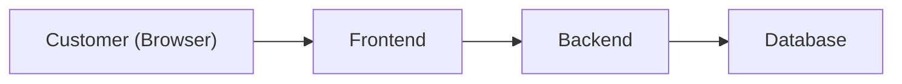
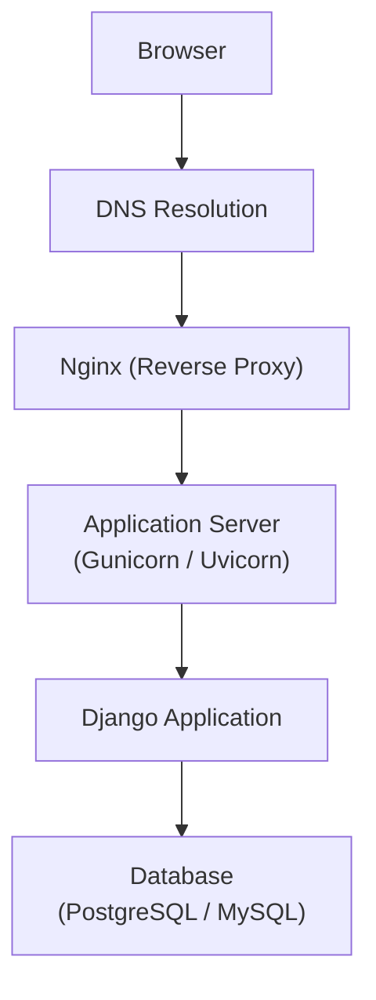
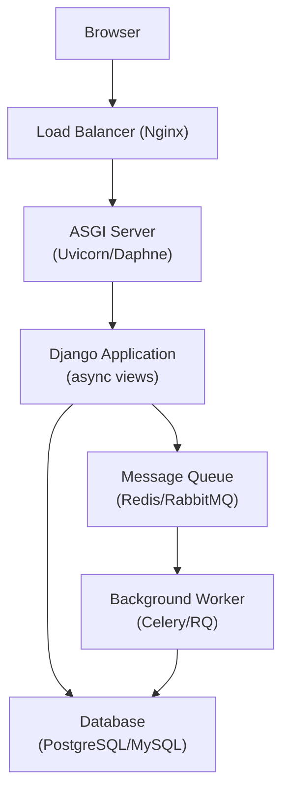

# 02. Web Fundamentals (Django)

## From Browser to Backend — Understanding the Request Flow

### 1) High-level request flow (the big picture)

> **Tip**: Some preview tools don’t render Mermaid diagrams. If you’re seeing only the code block, use the plain-text diagram below.



```text
Customer (Browser) -> Frontend -> Backend -> Database
```

- The **frontend** is what the user sees (HTML/CSS/JS).
- The **backend** is the server-side application (e.g., Django) that processes requests and returns responses.
- The **database** is where persistent data is stored.

---

### 2) HTTP Basics (Request types)

Common HTTP methods used by browsers and APIs:

- **GET**: Fetch data.
- **POST**: Create new data.
- **PUT**: Update existing data.
- **DELETE**: Remove data.

Example URL:

```
https://www.weather.com/api/v1/weather
```

This URL maps to a backend handler that returns the current weather data.

---

### 3) Simple analogy (Restaurant)

- **Customer** = User (browser)
- **Waiter** = Frontend (handles requests and responses)
- **Kitchen** = Backend (does the work, talks to database)

The waiter takes the order (request), sends it to the kitchen (backend), and brings back the food (response).

---

### 4) Core networking concepts (IP & DNS)

When you type a URL like `www.google.com` in your browser:

1. The browser performs a **DNS lookup** to map the hostname to an IP address.
2. The browser sends an HTTP request to the server at that IP address.
3. The server processes the request and returns HTML/CSS/JS (or JSON for APIs).

This is why: `URL -> DNS -> IP -> request -> response`.

---

### 5) Deployment request path (real-world stack)

Below is a common production architecture for a Django app:



- **DNS** resolves the hostname to an IP address.
- **Nginx** acts as a reverse proxy (TLS termination, load balancing, caching).
- **Gunicorn/Uvicorn** run the Python app and speak WSGI/ASGI.
- **Django** handles routing, views, and ORM/database access.

---

### 6) Django at Scale: ASGI, Event Loops, and Message Queues

Modern large-scale systems use **ASGI** and **message queues** to build scalable backends. This section explains why and how.

#### 6.1) Traditional Django (WSGI)

**Stack (simplified):**

```
User Request
     │
     ▼
Load Balancer (Nginx)
     │
     ▼
WSGI Server (Gunicorn / uWSGI)
     │
     ▼
Django Application
     │
     ▼
Database (PostgreSQL / MySQL)
```

**Key limitation (synchronous):**
- Each worker handles **one request at a time**.
- If a request waits for the database or an external API, that worker is blocked until the response arrives.

This is fine for many sites, but it becomes costly at scale when requests involve slow I/O.

#### 6.2) Modern Django (ASGI)

**What changes:**
- ASGI supports **async views** and **event loops**, allowing a single worker to manage many in-flight requests.
- Instead of blocking while waiting for I/O, the worker can switch to another request.

**Stack (simplified):**

```
User Request
     │
     ▼
Load Balancer (Nginx)
     │
     ▼
ASGI Server (Uvicorn / Daphne)
     │
     ▼
Django Application (async-compatible)
     │
     ▼
Database / External APIs
```

**Why it matters at scale:**
- A worker can serve many more concurrent requests because it doesn’t sit idle during I/O.
- Great for real-time features like **WebSockets**, **server-sent events**, and streaming.

#### 6.3) Event loops in a nutshell

- An **event loop** runs continuously, picking up ready work and running it.
- When a task hits `await`, it yields control back to the loop.
- The loop then runs another task until the awaited work is ready.

Example (async view):

```python
from httpx import AsyncClient

async def weather_view(request):
    async with AsyncClient() as client:
        resp = await client.get("https://api.weather.com/v1/…")
    return JsonResponse(resp.json())
```

#### 6.4) Message queues (background work)

Some tasks should not block a request at all (e.g., sending email, resizing images, syncing analytics). Those are moved to **background workers** via a message queue.

**Typical pattern:**

1. Web request enqueues a job (task message) into a queue (Redis, RabbitMQ).
2. Worker processes (Celery, RQ, Dramatiq) consume jobs from the queue.
3. Worker performs the work (e.g., send email, generate thumbnail) and updates the database.

**Example flow:**

- User uploads a photo (request handled immediately).
- Django enqueues a `resize_image` task.
- Worker picks up task, resizes, then writes metadata to the database.

#### 6.5) When to choose WSGI vs ASGI (decision checklist)

**Choose WSGI when:**
- Your app is mostly **request/response** (HTML pages or JSON APIs).
- You don’t need WebSockets or long-lived connections.
- You’re OK running more worker processes (each can only handle one request at a time).

**Choose ASGI when:**
- You need **high concurrency** without firing up many workers.
- You use **WebSockets**, **server-sent events**, or other real-time protocols.
- You have many slow external calls (HTTP APIs, database, third-party services) and want the worker to keep doing work while waiting.

> Note: Django supports both WSGI and ASGI in the same project. You can start with WSGI and migrate pieces to ASGI as needed.

#### 6.6) Threads, workers, and the GIL (what WSGI servers do)

- Many WSGI servers (e.g., Gunicorn, uWSGI) use **multiple worker processes** to handle concurrency.
- Each worker can also run **multiple threads**, allowing more than one request at a time in that process.
- In **CPython**, the **Global Interpreter Lock (GIL)** means only one thread can execute Python bytecode at a time.
  - Threads are still useful for I/O-bound work because while one thread waits for I/O, another can run.
  - For CPU-bound work, multiple processes (not threads) are the better scaling path.

**How this affects Django apps:**
- A WSGI worker (process) can handle multiple requests with threads, but it still blocks on Python execution.
- Scaling typically involves increasing worker count rather than relying on threads alone.

#### 6.7) Concrete example: Celery task + enqueue (background work)

##### Task definition (`tasks.py`)

```python
from celery import shared_task
from django.core.mail import send_mail

@shared_task
def send_welcome_email(user_id):
    # Fetch user data (DB access should be minimal in tasks)
    from django.contrib.auth import get_user_model
    User = get_user_model()
    user = User.objects.get(pk=user_id)

    send_mail(
        subject="Welcome!",
        message="Thanks for signing up.",
        from_email="no-reply@example.com",
        recipient_list=[user.email],
    )
```

##### Enqueue from a view (`views.py`)

```python
from django.http import JsonResponse
from .tasks import send_welcome_email

def signup_view(request):
    # ... create user in DB ...
    user = User.objects.create(...)  # simplified

    # Enqueue background work (non-blocking)
    send_welcome_email.delay(user.id)

    return JsonResponse({"status": "ok"})
```

##### Running the worker (terminal)

```bash
celery -A your_project_name worker -l info
```

This keeps the HTTP request fast while the slow work (email sending) happens asynchronously.

#### 6.7) Putting it together (realistic scale stack)



---

### 7) What you’ll build next

In a Django backend, you’ll use these concepts to:
- Define URL routes (e.g., `/api/v1/weather`)
- Handle requests in views or viewsets
- Use serializers (Django REST Framework) to convert between JSON and Python objects
- Talk to the database using ORM models

---

*Next: Learn how Django maps URLs to views and how REST APIs fit into this flow.*


