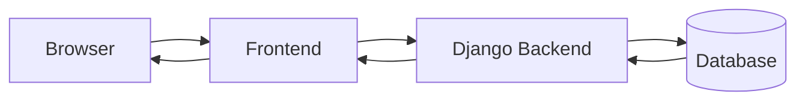
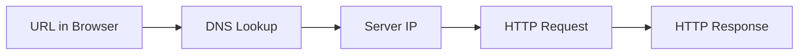
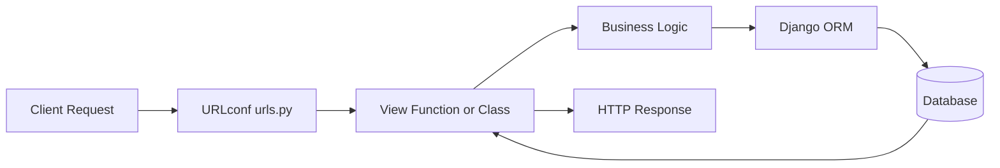
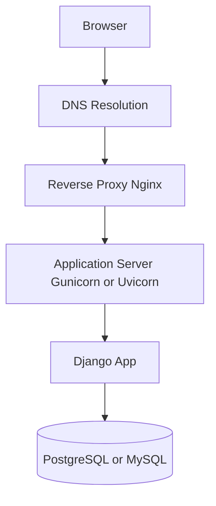
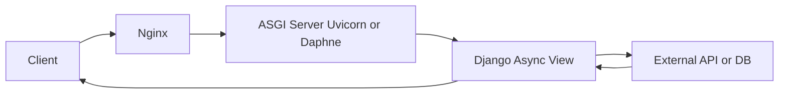
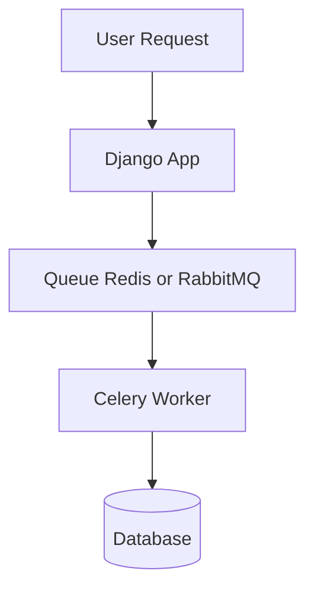
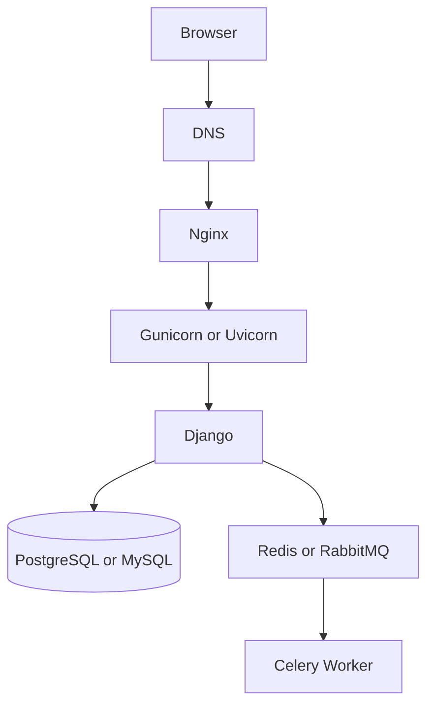

# 02. Web Fundamentals (Django)

## Overview

This page explains how a web request moves from a browser to a Django backend and back as a response.

Focus areas:

- browser-to-backend request flow
- HTTP methods and status code basics
- URL, DNS, IP, and routing
- Django request lifecycle
- production request path at a high level

This module starts with fundamentals and then extends into advanced scalability concepts used in real production systems.

## Key Concepts

### Browser to backend request flow

A user action in the browser creates an HTTP request. The backend processes it and returns a response.



Quick interpretation:

- browser shows UI and captures user actions
- frontend sends requests to backend endpoints
- Django applies business logic and accesses data
- response returns as HTML or JSON

### HTTP methods and status code intuition

Common methods:

- `GET`: read data
- `POST`: create data
- `PUT`: replace/update data
- `PATCH`: partial update
- `DELETE`: remove data

Status code families:

- `2xx`: success (`200`, `201`)
- `3xx`: redirect (`301`, `302`)
- `4xx`: client-side issue (`400`, `401`, `403`, `404`)
- `5xx`: server-side issue (`500`, `503`)

### URL, DNS, and IP basics

When a user opens `https://example.com/products`:

1. Browser parses the URL.
2. DNS resolves `example.com` to an IP address.
3. Browser opens a connection to that server.
4. Browser sends an HTTP request for `/products`.
5. Server returns a response.



### Django request lifecycle

Django handles incoming requests through URL routing and views.



Lifecycle summary:

- `urls.py` maps URL path to a view
- view validates input and runs logic
- ORM reads/writes data if needed
- view returns response (`JsonResponse`, template, redirect)

### Production request path basics

A common production path for Django apps:



Role of each component:

- DNS maps domain to server address
- reverse proxy handles TLS termination and request forwarding
- app server runs Django processes
- Django handles app logic
- database stores persistent data

## Examples

### Example 1: Read a product list

Request:

```http
GET /products HTTP/1.1
Host: shop.example.com
```

Expected flow:

1. URL resolves to backend IP.
2. Django route maps `/products` to a view.
3. View reads products from database.
4. Response returns with status `200`.

### Example 2: Create a product

Request:

```http
POST /products HTTP/1.1
Content-Type: application/json

{
  "name": "Mechanical Keyboard",
  "price": 89.0
}
```

Expected outcome:

- server validates payload
- record is inserted in database
- response returns `201 Created`

## Real World Usage

These fundamentals are used in every backend project:

- building CRUD APIs for web and mobile apps
- debugging `404` and `500` issues by tracing request flow
- reviewing deployment architecture (domain, proxy, app server, DB)
- understanding where authentication, validation, and business logic should run

Next topics after this module:

- REST API design and versioning
- Django ORM query patterns
- authentication and security
- testing and reliability
- async jobs and production deployment

## Advanced Concepts

### WSGI vs ASGI in Django

Traditional Django deployments use WSGI servers. WSGI is synchronous by design, so a worker handles one blocking request at a time.

ASGI supports asynchronous request handling, making it better for high-concurrency and real-time use cases.

Choose WSGI when:

- traffic is moderate and request/response is straightforward
- workloads are mostly synchronous
- operational simplicity is the priority

Choose ASGI when:

- you need WebSockets or long-lived connections
- the app performs many I/O-heavy external calls
- you want better concurrency with async views



### Event loop intuition

In async code, when an operation uses `await`, execution yields control so the server can process another request while waiting for I/O.

Example async view:

```python
from django.http import JsonResponse
from httpx import AsyncClient

async def weather_view(request):
    async with AsyncClient() as client:
        resp = await client.get("https://api.weather.com/v1/current")
    return JsonResponse(resp.json())
```

### Message queues and background workers

Some tasks should run outside the request/response path to keep endpoints fast.

Common examples:

- sending welcome emails
- image/video processing
- report generation
- retrying failed third-party API syncs

Typical queue flow:

1. Django receives request and stores critical data.
2. Django enqueues a background task to Redis or RabbitMQ.
3. Celery worker consumes the task.
4. Worker executes job and updates database or logs result.



### Celery example: task and enqueue

Task definition:

```python
from celery import shared_task
from django.core.mail import send_mail

@shared_task
def send_welcome_email(user_id, email):
    send_mail(
        subject="Welcome!",
        message="Thanks for signing up.",
        from_email="no-reply@example.com",
        recipient_list=[email],
    )
```

Enqueue from a view:

```python
from django.http import JsonResponse
from .tasks import send_welcome_email

def signup_view(request):
    # Example only: parse payload and create user first
    user_id = 101
    email = "user@example.com"
    send_welcome_email.delay(user_id, email)
    return JsonResponse({"status": "accepted"}, status=202)
```

Worker command:

```bash
celery -A your_project_name worker -l info
```

### Threads, processes, and the GIL

In CPython, the Global Interpreter Lock (GIL) allows only one thread to execute Python bytecode at a time per process.

Practical impact:

- threads still help for I/O-bound workloads
- processes are usually better for CPU-bound workloads
- production scaling often combines multiple worker processes with careful timeout and queue settings

### Extended production stack



This stack separates request handling from heavy background processing and improves latency under load.

## Resources

- Django Documentation: https://docs.djangoproject.com/
- MDN HTTP Overview: https://developer.mozilla.org/en-US/docs/Web/HTTP/Overview
- MDN DNS Basics: https://developer.mozilla.org/en-US/docs/Learn/Common_questions/Web_mechanics/What_is_a_domain_name
